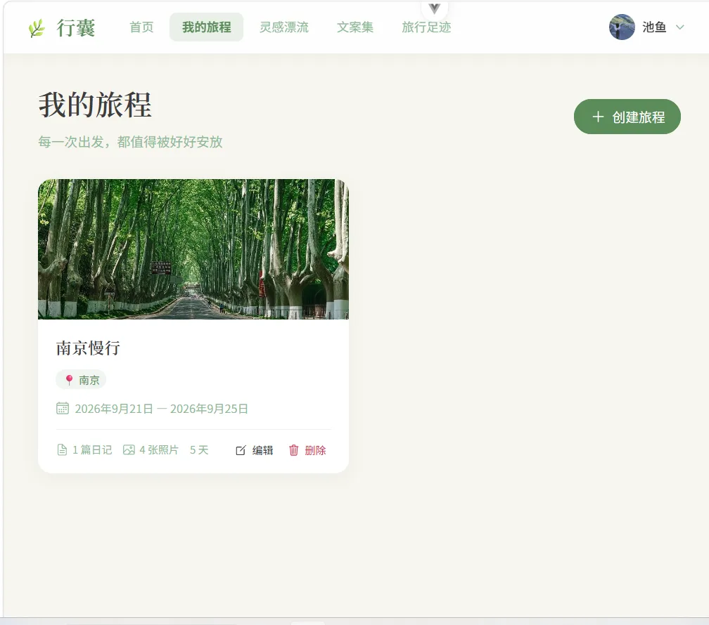
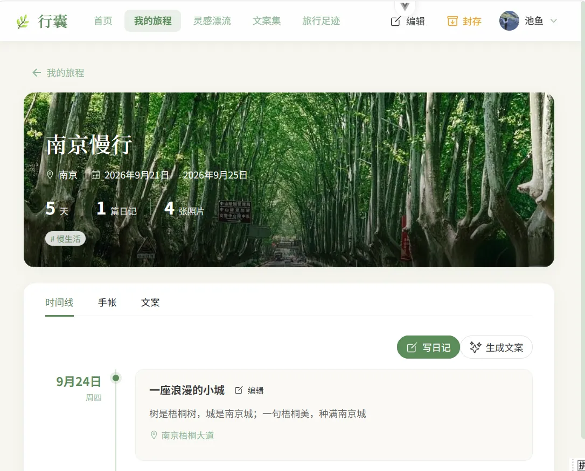
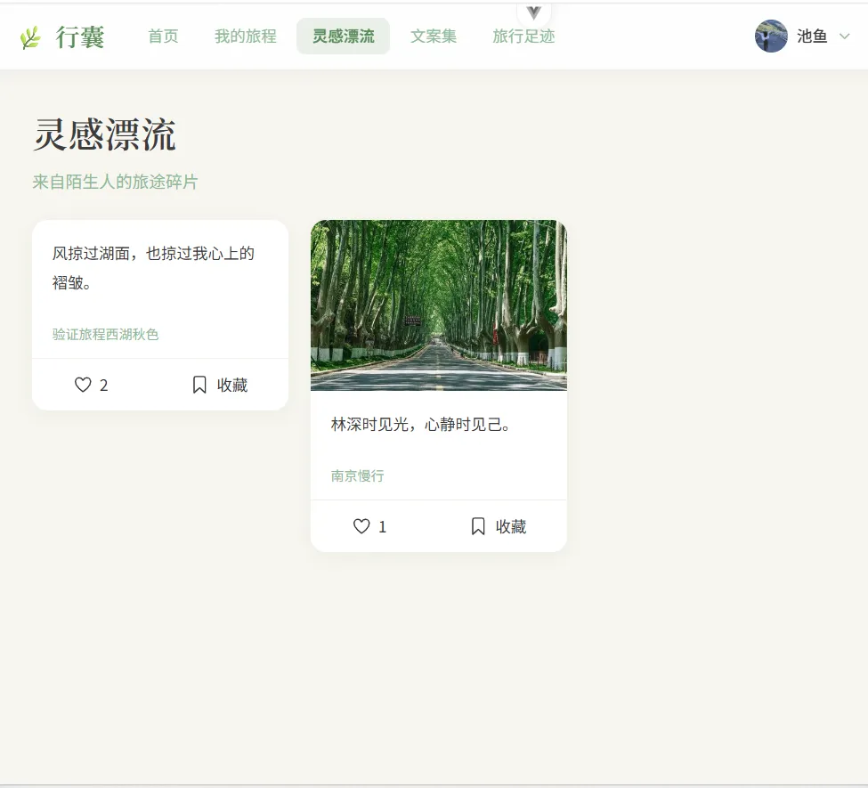
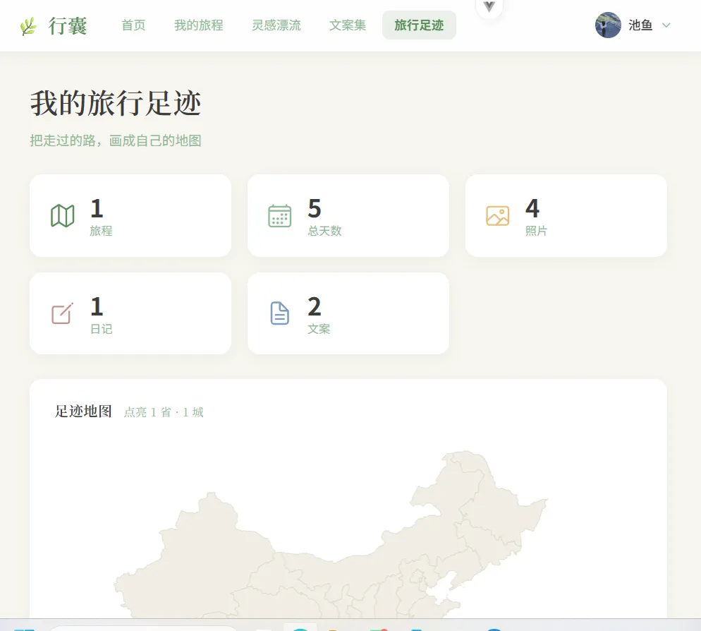
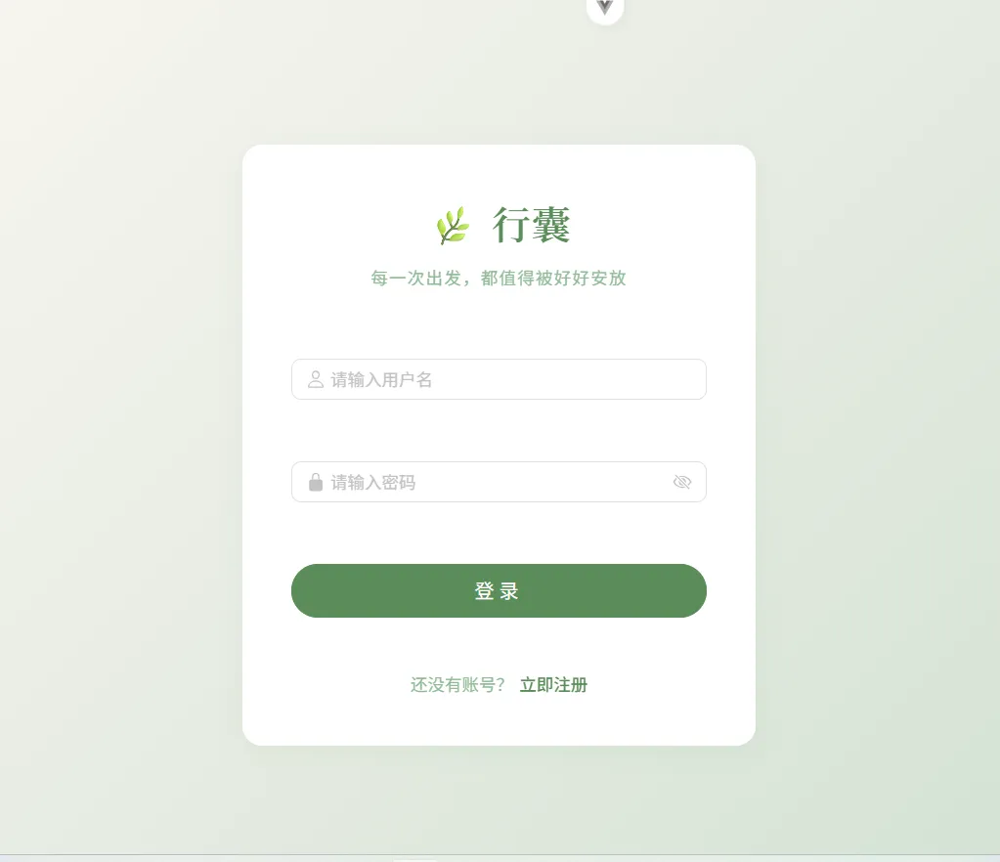

# 🌿 行囊 · XingNang

> **每一次出发，都值得被好好安放。**
> 一款面向旅行爱好者的**个人旅行记忆 & AI 文案创作平台** —— 记录旅程、沉淀心情，并让 AI 帮你找到那句恰到好处的旅行文案。

    

---

## ✨ 项目简介

《行囊》是一个前后端分离的全栈应用。用户可以创建**旅程**、上传**照片**、写**日记**、一键生成可翻阅的**电子旅行手帐**；还能对着一张照片，由 **AI 多模态识别画面场景**并生成三种风格的旅行文案；通过**灵感漂流**浏览、点赞、收藏他人公开的文案。

- 🧳 **旅程档案馆** —— 旅程 CRUD、照片/日记、时间线、足迹地图、电子手帐、旅程封存
- ✍️ **此刻文案** —— DeepSeek 多模态看图识景，一次生成「短句 / 叙事 / 诗意」三版本，可编辑保存
- 🌊 **灵感漂流** —— 公开文案瀑布流、匿名展示、点赞、收藏（幂等）
- 📊 **旅行统计** —— 总览 / 城市足迹 / 心情分布 / 每月旅程（ECharts + 城市级 Leaflet 地图）
- 🔐 **认证鉴权** —— JWT 无状态登录、全局守卫、统一异常处理与响应格式

---

## 🖼️ 效果展示

| 首页 | 我的旅程 |
| :---: | :---: |
|  |  |

| 旅程详情（时间线） | 电子手帐 |
| :---: | :---: |
|  |  |

| 我的文案集 | 灵感漂流 |
| :---: | :---: |
|  |  |

| 旅行足迹（统计+地图） | 登录 |
| :---: | :---: |
|  |  |

---

## 🛠️ 技术栈

### 前端 `frontend/`
Vue 3.5 · TypeScript 6 · Vite 8（Rolldown）· Naive UI 2.45（按需引入）· Pinia 3 · Vue Router 5 · Tailwind CSS 3.4 · Axios · ECharts 6 · wangEditor 5 · Leaflet 1.9 · Vitest

### 后端 `backend-nestjs/`
NestJS 12 · TypeScript 6 · Prisma 6 · PostgreSQL 16 · Redis 7（ioredis，优雅降级缓存）· Passport + JWT · bcrypt · class-validator · sharp（缩略图）· exifr（EXIF/GPS）· compression（gzip）· Vitest

### AI
DeepSeek API（`deepseek-flash` 多模态）—— 单次调用完成「看图识别场景 + 生成三风格文案」，`response_format=json_object` 取结构化结果；未配置 Key 时优雅降级返回 503，不影响其余功能。

---

## 🚀 快速开始

### 前置要求
- **Node.js** ≥ 22.18（建议 22 LTS / 24）
- **Docker Desktop**（一键起 PostgreSQL；Redis 可选）
- DeepSeek API Key（可选，仅 AI 文案功能需要）

### 1. 启动后端（端口 3000）
```powershell
cd backend-nestjs
docker-compose up -d        # 起 PostgreSQL（+ Redis 可选）
cp .env.example .env        # 按下文填写环境变量
npx prisma db push          # 同步表结构
npm install
npm run start:dev           # 热重载启动
```
健康检查：http://localhost:3000/api/health

### 2. 启动前端（端口 5173）
```powershell
cd frontend
npm install
npm run dev                 # 默认读 .env.development，指向后端 3000
```
浏览器打开 **http://localhost:5173**，未登录会自动跳转 `/login`。

### 环境变量（`backend-nestjs/.env`）
| 变量 | 说明 |
|------|------|
| `DATABASE_URL` | PostgreSQL 连接串（docker-compose 默认已对应） |
| `JWT_SECRET` / `JWT_EXPIRES_IN` | JWT 签名密钥 / 有效期（默认 24h） |
| `DEEPSEEK_API_KEY` | AI 文案 Key（可选，留空则文案生成功能降级） |
| `DEEPSEEK_MODEL` | 默认 `deepseek-flash`（多模态） |
| `REDIS_HOST` / `REDIS_PORT` | Redis（可选，不起则缓存自动降级直查库） |

> ⚠️ 真实 `.env` 不入库，仓库仅提供 `.env.example` 模板，克隆后复制填写即可。

### 常用命令
| 目录 | 命令 |
|------|------|
| 后端 | `npm run start:dev` · `npm run build` · `npm test`（39 例）· `npm run lint` |
| 前端 | `npm run dev` · `npm run build` · `npm run type-check` · `npm test`（32 例） |

---

## 📁 目录结构

```
xingnang/
├── frontend/            # Vue 3 + Naive UI 前端
│   └── src/{api,views,components,stores,router,utils,config}
├── backend-nestjs/      # NestJS + Prisma 后端
│   ├── prisma/schema.prisma
│   └── src/{auth,journey,diary,photo,copywriting,stats,user,cache,health,prisma,common}
└── docs/                # 对外文档
    ├── 技术选用说明.md
    └── screenshots/     # 效果截图
```

---

## 📚 文档

- **[技术选用说明](docs/技术选用说明.md)** —— 每项技术选型的理由（适合面试准备）
- **[后端 API 测试指南](backend-nestjs/API_TEST_GUIDE.md)** —— 全量接口清单与自测
- **[后端说明](backend-nestjs/README.md)** · **[前端说明](frontend/README.md)**

---

## 🧪 项目状态

前后端功能均已开发完成，主流程可本地运行：认证 → 旅程/日记/照片 → AI 文案 → 灵感漂流 → 统计与手帐。服务层单元测试后端 39 例、前端 32 例。

---

如果这个项目对你有帮助，欢迎点个 ⭐️ Star。
